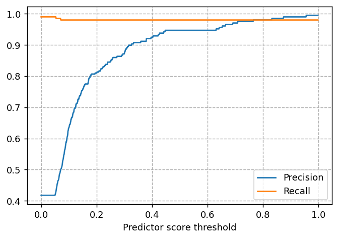
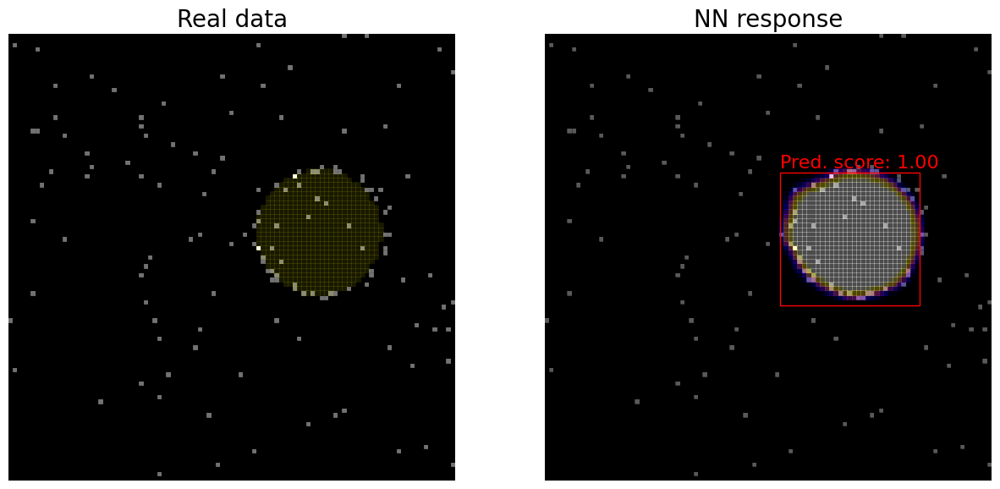
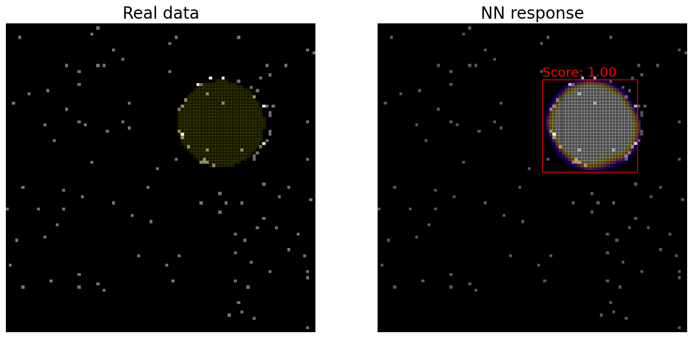
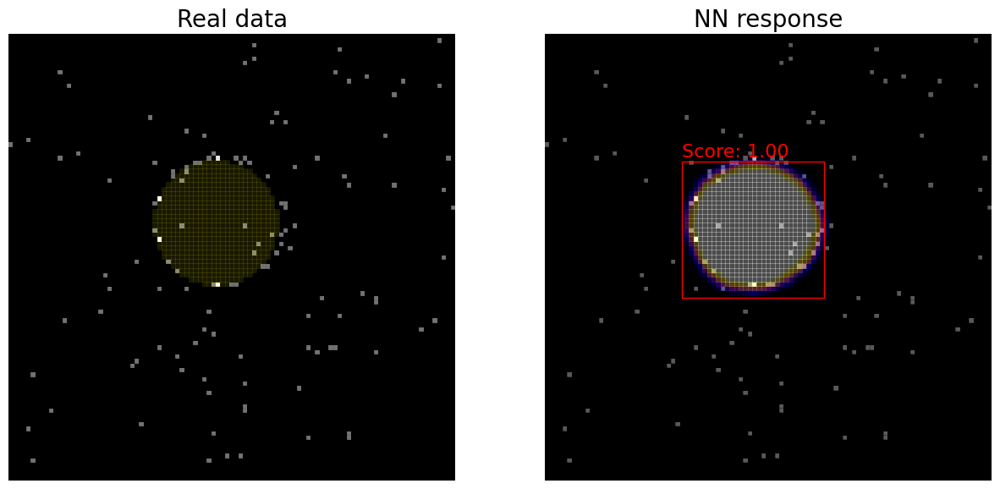
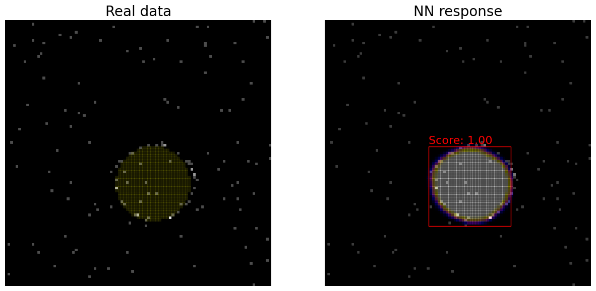
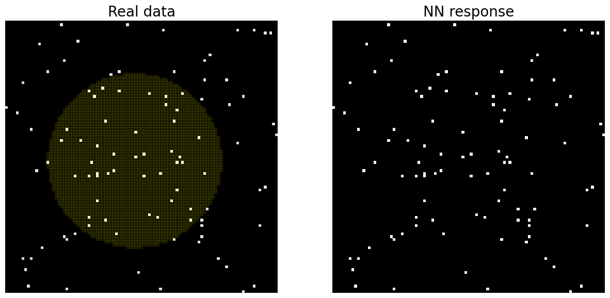
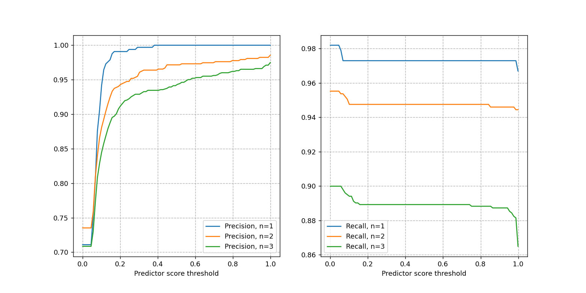

# FARICH-pics

 

Rings detection for FARICH

## Neural network (nn)

We have trained nn to detect rings with [this tutorial](https://pytorch.org/tutorials/intermediate/torchvision_tutorial.html).

Dataset contains **100x100px** boards with **one ring** on each and uniform **noise 1%**.

Technical details you can see in [the notebook](notebooks/CirclesNN.ipynb)
 

### Results

Precision and recall vs treshold predictor score:

Some detection examples

Good/perfect examples:

Bad example:

Most problems from such images but even we cannot detect there rings. Why should nn?

## NN for many circles

We also trained nn for many circles (see [notebook](notebooks/ManyCirclesNN.ipynb))

### Results
Precision and recall vs treshold predictor score:

 

