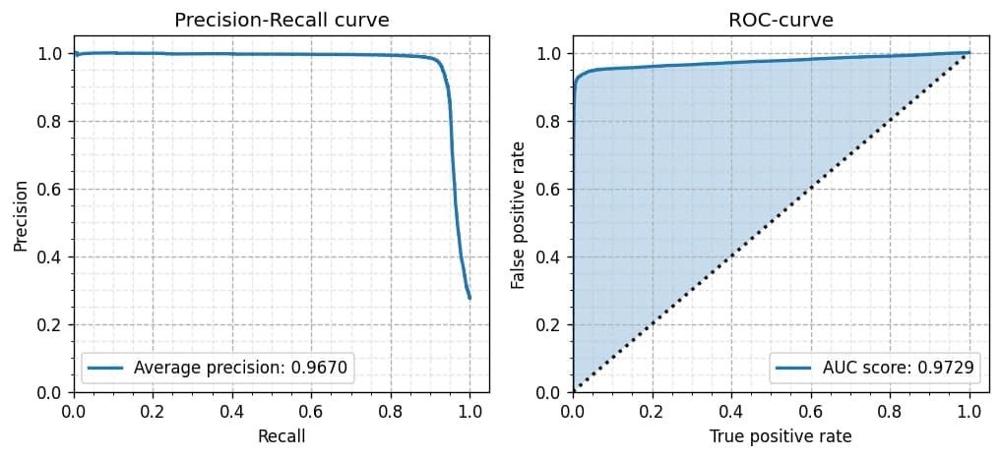
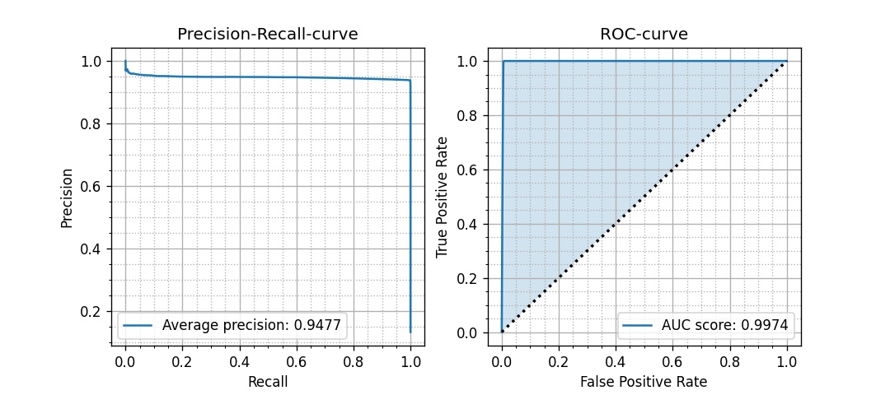

# [←](Home.md) `ClassicVsML` 
Сравнение работы классического алгоритма и алгоритма машинного
обучения

## Работа алгоритма машинного обучения

Для разделения сигнальных и фоновых пикселов в детекторе Farich мы 
использовали [Minkowski Engine
net](https://github.com/NVIDIA/MinkowskiEngine) - удобный инструмент,
позволяющий осуществлять операции с разреженными данными, и
собственную небольшую сверточную нейронную сеть (см.
[код](https://colab.research.google.com/drive/1ljftwmqe19-c-599EU9eDCdjy6fRLjiJ?usp=sharing))
Для наших целей генерировалась 1000 досок с 500 кругами, 800 из которых
использовались для тренировки нейронной сети. В качестве лосс-функции 
использовалась кросс-энтропия. Метрики проверялись на оставшихся 200 досках.

Время обучения нейронной сети составило менее одного часа. 
Время работы ML-алгоритма на одной entry составляет 

## Работа классического алгоритма

В качестве классического алгоритма был использован
`Algorithms.classic_algo` из `farichlib`. Для наших целей
генерировалось 100 досок по 100 кругов в каждой (см. [код](https://github.com/82492749123082/farich-pics/blob/dev_yana/ClassicVsMl.ipynb))

Время работы классического алгоритма на одной entry составляет около 3 мс

## Резюме

Видно, что алгоритм машинного обучения не превосходит классический
алгоритм ни по времени, ни по итоговым метрикам. 
