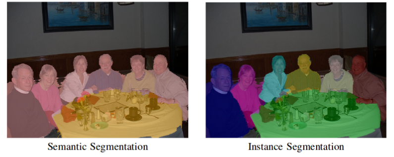

# [←](Home.md) Обзор методов машиного обучения
*(для разделения сигнальных/шумовых высвечиваний)*

## Image Segmentation
Можно считать наш случай трёхмерным изображением (`x`, `y`, `t` координаты) и применять к нему методы сегментации изображений, в данном случае на две части (сигнал и шум)

Тут у нас возникает два подкласса и одна проблема:
1. **Semantic segmentation**: присваиваем каждому пикселу лэйбл класса, причём объекты одного класса не различаем между собой (левый рисунок снизу)
1. **Instance segmentation**: semantic segmentation, но различаем между собой объекты одного класса (правый рисунок снизу)

И проблема: необходимо ли различать кольца от разных частиц между собой?
Думаю, *нет*.
Всё-таки одно кольцо может попасть в несколько блоков детектора, а мы их анализируем по отдельности, соответственно определять каждое кольцо некорректно.

Т.о. рассматриваем методы **Semantic segmentation**.

### Fully Convolutional Network (FCN)

Источники:
1. [TowardsDataScience](https://towardsdatascience.com/semantic-segmentation-popular-architectures-dff0a75f39d0)

### U-Net

Источники:
1. [TowardsDataScience](https://towardsdatascience.com/semantic-segmentation-popular-architectures-dff0a75f39d0)
1. [HeartBeat](https://heartbeat.fritz.ai/a-2019-guide-to-semantic-segmentation-ca8242f5a7fc)
1. [BeyondMinds](https://beyondminds.ai/a-simple-guide-to-semantic-segmentation/)
1. [Arxiv](https://arxiv.org/abs/1505.04597)

### Mask-RCNN

Источники:
1. [TowardsDataScience](https://towardsdatascience.com/semantic-segmentation-popular-architectures-dff0a75f39d0)

[**Вернуться на главную**](Home.md)